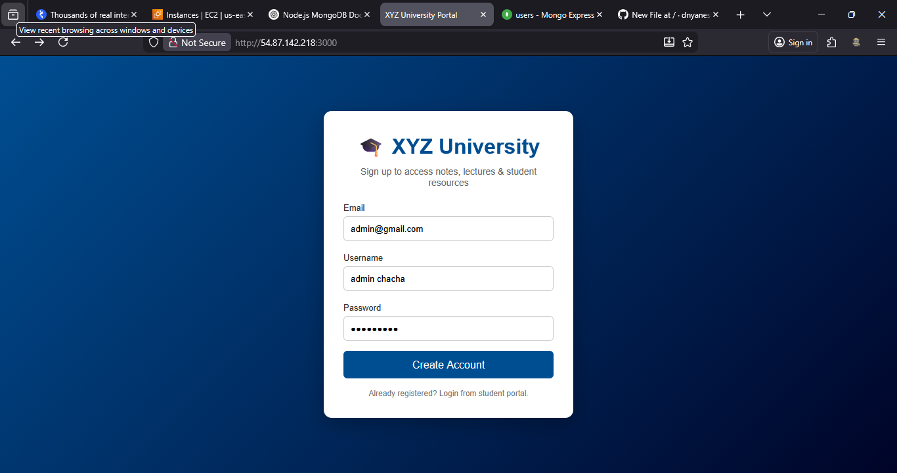
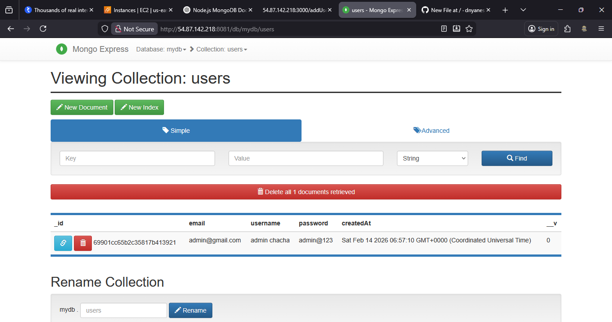
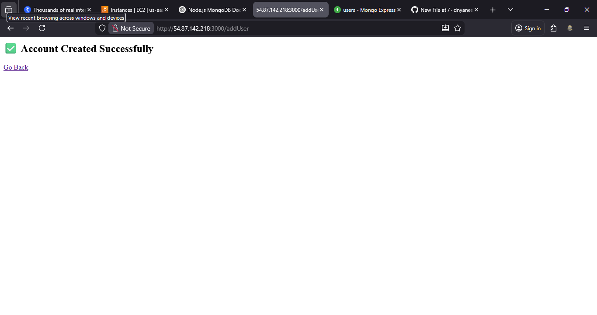

# 🎓 XYZ University Signup Portal

This project is a student signup portal built using **Node.js, Express, MongoDB, and Docker**.
It allows students to register and store their information securely in a database.

The entire application runs inside Docker containers, which makes it easy to deploy and run on any server without manual setup.

---

## 🚀 How the Application Works

When a user opens the signup page in a browser, they can enter their email, username, and password.
The Node.js application receives this data and stores it in MongoDB.
Mongo Express is included to allow administrators to view and manage database records through a web interface.

---

## 🐳 Why Docker is Used

Docker is used to containerize the application so that it runs consistently across different environments.
It removes the need to manually install Node.js or MongoDB on the server and allows the entire system to start with a single command.

---

## 📦 Project Structure

The project contains a Node.js application and Docker configuration files.

```
docker-nodeapp/
│
├── docker-compose.yml   → defines services
└── nodeapp/
    ├── Dockerfile       → builds Node app container
    ├── server.js        → backend logic
    ├── package.json     → dependencies
    └── public/          → frontend files
```

---

## 🚀 How to Run the Project

Start the application using Docker Compose:

```bash
docker-compose up -d --build
```

This command builds the Node.js image, starts MongoDB, and runs the application in the background.

To stop the application:

```bash
docker-compose down
```

---

## 🌐 Access the Application

After the containers start, open the following URLs in your browser:

Signup Portal:

```
http://SERVER-IP:3000
```


Mongo Express (Database Admin UI):

```
http://SERVER-IP:8081
```


Login credentials:

```
username: admin
password: qwerty
```

---

## 🗄 Database Information

User data is stored in the `mydb` database inside the `users` collection.
MongoDB data is persisted using a Docker volume, so it remains safe even if containers restart.

---

## 🧪 Available Routes

The application provides an endpoint to create users and another to view stored users.

Create a new user:

```
POST /addUser
```


View all users:

```
GET /users
```

---
